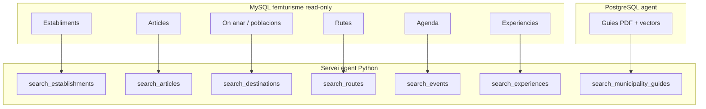

# Domini femturisme — Model de negoci per a l'agent de xat

**Font de veritat** sobre el que és femturisme.cat des del punt de vista de l'assistent conversacional.

| Camp | Valor |
|------|-------|
| **Versió** | 1.1 |
| **Data** | 2026-06-28 |
| **Canvi respecte v1.0** | Catàleg ampliat de 4 a **6 buscadors** MySQL (+ guies PDF) |
| **Documents derivats** | [document-funcional-client-ca.md](document-funcional-client-ca.md), [especificacio-funcional-ca.md](especificacio-funcional-ca.md), [especificacio-tecnica-ca.md](especificacio-tecnica-ca.md), [sql-mapeo.md](sql-mapeo.md) |

---

## 1. Propòsit i audiència

Aquest document descriu **el negoci femturisme** tal com l'agent de xat ha d'entendre'l:

- Quines **fonts d'informació** existeixen.
- Què distingeix **agenda**, **experiències**, **establiments**, etc.
- Com es mapen (preliminarment) a MySQL i al codi.

**Audiència:** client, producte, analista, desenvolupadors abans d'estimar o programar.

Els altres documents **enllacen aquí** i no redefineixen el domini.

---

## 2. Visió general

L'agent consulta **7 fonts** en total:

| # | Font | BD | Descripció breu |
|---|------|-----|-----------------|
| 1 | **Establiments** | MySQL | On dormir i on menjar (mateixa entitat, filtre per tipus) |
| 2 | **Articles / notícies** | MySQL | Contingut editorial sobre poblacions, esdeveniments, parcs naturals… |
| 3 | **On anar** | MySQL | Pobles i poblacions amb descripcions turístiques |
| 4 | **Rutes** | MySQL | Itineraris (a peu, bici, etc.) |
| 5 | **Agenda** | MySQL | Esdeveniments de calendari (fires, concerts, festes…) |
| 6 | **Experiències** | MySQL | Activitats promocionals lligades a establiment o població |
| 7 | **Guies PDF** | PostgreSQL | Fulletons municipals indexats (cerca semàntica) |

---

## 3. Distincions crítiques de negoci

### 3.1 Agenda vs experiències

| | **Agenda** (`search_events`) | **Experiències** (`search_experiences`) |
|---|------------------------------|----------------------------------------|
| **Què és** | Esdeveniment de **calendari** (data concreta o interval) | Activitat **promocional** que penja d'un establiment o d'una població |
| **Exemples** | Fira medieval, concert, festa major | Dinar de Sant Valentí en un restaurant; arrossada popular a Olvan |
| **Pregunta típica** | «Què fem aquest cap de setmana a l'Empordà?» | «Quina arrossada hi ha a Olvan?» |
| **Filtres clau** | Destinació + **dates** | Destinació + categoria; opcional establiment/població |
| **Secció web** | `/agenda` | TBD (hipòtesi: `/ofertes` o secció pròpia — confirmar amb schema) |

**No confondre:** l'antic model anomenava «ofertes» com `search_experiences`. En el model nou, **experiències** té el significat de negoci descrit pel client (activitat lligada a establiment/població).

### 3.2 Establiments: dormir + menjar

| | Detall |
|---|--------|
| **Entitat** | **Establiment** (taula d'establiments al CMS) |
| **Tipus** | Hotel, camping, restaurant, bar, etc. — filtre per **tipus** |
| **Un sol buscador** | `search_establishments` (no dos buscadors separats) |
| **Preguntes** | «On dormir a Girona», «Restaurant a Pals», «On menjar al Berguedà» |

Substitueix l'antic `search_accommodations` (només allotjament).

### 3.3 On anar vs establiments vs articles

| Domini | Contingut |
|--------|-----------|
| **On anar** | Fitxa de **població** o lloc: descripció, què veure, context territorial |
| **Establiments** | Negoci concret on dormir o menjar |
| **Articles** | Notícia o article sobre un tema (parcs naturals, esdeveniments, consells…) |

---

## 4. Catàleg per domini

### 4.1 Establiments (on dormir i on menjar)

| Camp | Valor |
|------|-------|
| **Descripció** | Cerca d'establiments turístics per zona i tipus (allotjament, restauració…). |
| **Exemples de preguntes** | «Hotel a Girona», «Camping Costa Brava», «On menjar a Berga», «Restaurant romàntic Empordà» |
| **Tool** | `search_establishments` |
| **Repository** | `EstablishmentsRepository` |
| **Paràmetres v1** | `destination` (optional si hi ha `query`), `type` (optional), `query` (optional, text lliure curt: plat, cuina, ingredient) |
| **Secció web** | `/on-dormir`, `/on-menjar`, `/que-fer` (llistats de navegació; no URL de fitxa) |
| **URL fitxa** | `https://www.femturisme.cat/establiments/{param_url}` — prefix fix per a tots els tipus (**Q-05 confirmat 2026-07-13**) |
| **Taules MySQL** | `establiment_general`, `establiment_continguts`, `establiment_tipus`, `generic_tipus_establiment`, `establiment_pobles`, `poble_general`, `poble_comarques` |
| **Relacions** | Experiències poden referenciar un establiment |

---

### 4.2 Articles / notícies

| Camp | Valor |
|------|-------|
| **Descripció** | Articles o notícies sobre poblacions, esdeveniments, parcs naturals, temes diversos del portal. |
| **Exemples de preguntes** | «Notícies sobre el Parc Natural del Cadí», «Articles sobre la Patum de Berga», «Què escriu femturisme sobre Cadaqués» |
| **Tool** | `search_articles` |
| **Repository** | `ArticlesRepository` |
| **Paràmetres v1** | `destination` (optional), `topic` (optional), `query` (optional, text lliure curt) |
| **Secció web** | Notícies / editorial — **validar Q-05** |
| **URL fitxa** | Hipòtesi: `https://www.femturisme.cat/noticies/{param_url}` (**Q-05 TBD**) |
| **Taules MySQL** | `noticia_general`, `noticia_continguts`, `noticia_pobles`, `poble_general` |
| **Relacions** | Pot mencionar poblacions, esdeveniments, parcs; no substitueix agenda ni on anar |

---

### 4.3 On anar (poblacions i llocs)

| Camp | Valor |
|------|-------|
| **Descripció** | Informació sobre **pobles, municipis o llocs** per visitar: descripcions, context, què hi trobarà el visitant. |
| **Exemples de preguntes** | «Què veure a Besalú», «Com és visitar Pals», «Pobles bonics a l'Empordà» |
| **Tool** | `search_destinations` |
| **Repository** | `DestinationsRepository` |
| **Paràmetres v1** | `destination` (required), `region` (optional) |
| **Secció web** | Fitxes de població — **validar Q-05** |
| **URL fitxa** | Hipòtesi: `https://www.femturisme.cat/{param_url}` (**Q-05 TBD**) |
| **Taules MySQL** | `poble_general`, `poble_continguts`, `poble_comarques`, `generic_ubicacions` (comarca) |
| **Relacions** | Complementa agenda, rutes i establiments (context territorial) |

---

### 4.4 Rutes

| Camp | Valor |
|------|-------|
| **Descripció** | Itineraris turístics per zona i modalitat. |
| **Exemples de preguntes** | «Ruta a peu al Pirineu», «Ruta en bici per l'Empordà», «Senderisme Berguedà» |
| **Tool** | `search_routes` |
| **Repository** | `RoutesRepository` |
| **Paràmetres v1** | `destination` (required), `type` (optional: a peu, bici…) |
| **Secció web** | `/rutes` |
| **URL fitxa** | `https://www.femturisme.cat/rutes/{slug}` |
| **Taules MySQL** | `ruta_general`, `ruta_continguts`, `ruta_pobles`, `ruta_tematica`, `generic_tematiques`, `poble_*` |
| **Relacions** | Sovint vinculades a comarques o pobles de «on anar» |

---

### 4.5 Agenda (esdeveniments de calendari)

| Camp | Valor |
|------|-------|
| **Descripció** | Esdeveniments amb data: fires, concerts, festes, activitats programades al calendari públic. |
| **Exemples de preguntes** | «Què fem aquest cap de setmana a l'Empordà?», «Agenda Barcelona aquest mes», «Festes majors al Berguedà» |
| **Tool** | `search_events` |
| **Repository** | `EventsRepository` |
| **Paràmetres v1** | `destination` (required), `date_from`, `date_to` (optional) |
| **Secció web** | `/agenda` |
| **URL fitxa** | `https://www.femturisme.cat/agenda/{slug}` |
| **Taules MySQL** | `agenda_general`, `agenda_continguts`, `agenda_dates`, `agenda_pobles`, `poble_*` |
| **Relacions** | Distint d'experiències (§3.1) |

---

### 4.6 Experiències (activitats promocionals)

| Camp | Valor |
|------|-------|
| **Descripció** | Activitats que un **establiment** o una **població** «penja» com a proposta concreta (sovint amb acció comercial o promocional). |
| **Exemples de preguntes** | «Dinar de Sant Valentí al Berguedà», «Arrossada popular a Olvan», «Experiències en família a la Cerdanya» |
| **Tool** | `search_experiences` |
| **Repository** | `ExperiencesRepository` |
| **Paràmetres v1** | `destination` (required), `category` (optional), `establishment` (optional) |
| **Secció web** | Hipòtesi: `/ofertes` (legacy) — **confirmar Q-04 amb client** |
| **URL fitxa** | Hipòtesi: `https://www.femturisme.cat/ofertes/{param_url}` (**Q-05 TBD**) |
| **Taules MySQL** | `oferta_general`, `oferta_continguts`, `oferta_categories`, `generic_categoria_oferta`; FK `id_establiment`, `id_poble` |
| **Relacions** | Anchor: establiment o població; no substituir agenda |

---

### 4.7 Guies PDF (domini 7)

| Camp | Valor |
|------|-------|
| **Descripció** | Fulletons municipals pujats per l'equip femturisme; cerca semàntica dins el text. |
| **Exemples de preguntes** | «On dinar a Berga segons la guia?», «On aparcar segons el fulletó» |
| **Tool** | `search_municipality_guides` |
| **Dades** | PostgreSQL + vectors (no MySQL) |
| **Paràmetres v1** | `query` (required), `municipality` (required), `category` (optional) |
| **Administració** | Panell `/admin/guides` |

Veure [especificacio-tecnica-ca.md](especificacio-tecnica-ca.md) §6 per pipeline d'indexació.

---

## 5. Matriu de mapatge

| Domini negoci | Tool | Repository | BD | Estat schema |
|---------------|------|------------|-----|--------------|
| Establiments (dormir/menjar) | `search_establishments` | `EstablishmentsRepository` | MySQL | Schema OK — SQL ☐ |
| Articles / notícies | `search_articles` | `ArticlesRepository` | MySQL | Schema OK — SQL ☐ |
| On anar | `search_destinations` | `DestinationsRepository` | MySQL | Schema OK — SQL ☐ |
| Rutes | `search_routes` | `RoutesRepository` | MySQL | Schema OK — SQL ☐ |
| Agenda | `search_events` | `EventsRepository` | MySQL | Schema OK — SQL ☐ |
| Experiències | `search_experiences` | `ExperiencesRepository` | MySQL | Schema OK (hipòtesi `oferta_*`) — SQL ☐ |
| Guies PDF | `search_municipality_guides` | (servei RAG) | PostgreSQL | Definit a pla Fase 5 |

---

## 6. Mapatge des del model antic (4 tools)

Documentació i prototip anterior (scraping) usaven **4 buscadors**. Mapatge de migració:

| Model antic (v1.0 docs) | Model nou (v1.1) | Acció |
|---------------------------|------------------|-------|
| `search_accommodations` | **`search_establishments`** | Fusionar dormir + menjar; filtre `type` |
| `search_experiences` (secció `/ofertes`) | **`search_experiences`** (redefinit) | Canvi de significat: activitats promocionals |
| `search_events` | **`search_events`** | Mateix nom; definició reforçada (agenda) |
| `search_routes` | **`search_routes`** | Mateix nom |
| — | **`search_articles`** | **Nou** |
| — | **`search_destinations`** | **Nou** |

**Codi actual** ([app/services/tools/](../app/services/tools/)): encara implementa el model antic (4 tools + scraping). **Objectiu v1:** 6 tools + MySQL segons aquest document.

---

## 7. Preguntes obertes (schema MySQL)

Font: [schema.sql](../schema.sql) (export client 2026-07-07). Detall SQL: [sql-mapeo.md](../sql-mapeo.md).

| # | Pregunta | Resposta schema (2026-07) | Estat |
|---|----------|---------------------------|-------|
| Q-01 | Nom exacte de la taula d'**establiments** i com es distingeix tipus dormir vs menjar | Taula `establiment_general`. Tipus via `establiment_tipus` → `generic_tipus_establiment` (`code`, `tipus_ca`). Camp `eg.tipus` (int) també existeix — validar relació | Parcial |
| Q-02 | On viuen **articles/notícies** i quins camps retornar | `noticia_general` + `noticia_continguts` (`titol`, `param_url`, `cos`, `data`, `imatge`) | Parcial |
| Q-03 | Taula(s) de **poblacions / on anar** i relació amb comarques | `poble_general` + `poble_continguts`; comarca via `poble_comarques.id`; `generic_ubicacions` per zones agregades | Parcial |
| Q-04 | Taula i relacions d'**experiències** vs agenda | Agenda = `agenda_*`. Hipòtesi experiències = `oferta_*` amb FK `id_establiment` / `id_poble` | **Confirmar client** |
| Q-05 | URL canònica per experiències, articles, establiments, pobles | Rutes/agenda confirmats a tecnic. Resta hipòtesi a sql-mapeo §hipòtesis | **Confirmar client** |
| Q-06 | Regles `publicat`, dates vigents, idioma per entitat | Documentades per domini a sql-mapeo §1.4–6.4; validar valors reals amb dump | Parcial |
| Q-07 | Límits de JOINs legacy per buscador | Màx. 6–8 JOINs per query; evitar `fitxa`, `client`, taules admin | Documentat |
| Q-08 | On emmagatzemar `entity_id` (UUID) a fitxes MySQL | **No apareix al schema** — Fase producte 2 | Obert |

Respostes completes aniran a [sql-mapeo.md](../sql-mapeo.md) quan es provi SQL amb dump.

---

## 8. Estat implementació: actual vs objectiu

| Component | Avui (prototip) | Objectiu v1 |
|-----------|-----------------|-------------|
| Tools catàleg | 4 (`experiences`, `accommodations`, `events`, `routes`) | **6** (veure §5) |
| Font de dades catàleg | Scraping HTML femturisme.cat | **MySQL read-only** |
| Guies PDF | Stub / parcial | Pipeline + `search_municipality_guides` |
| `sql-mapeo.md` | 6 tools — schema mapejat; SQL borrador ☐ provada |

---

## 9. Referències

| Document | Ús |
|----------|-----|
| [document-funcional-client-ca.md](document-funcional-client-ca.md) | Què es construirà (llenguatge client) |
| [especificacio-funcional-ca.md](especificacio-funcional-ca.md) | Requeriments i UAT |
| [especificacio-tecnica-ca.md](especificacio-tecnica-ca.md) | APIs, JSON, desplegament |
| [sql-mapeo.md](sql-mapeo.md) | SQL per tool (Fase 2–3) |
| [plan-integracion-ca.md](plan-integracion-ca.md) | Pla intern per fases |
