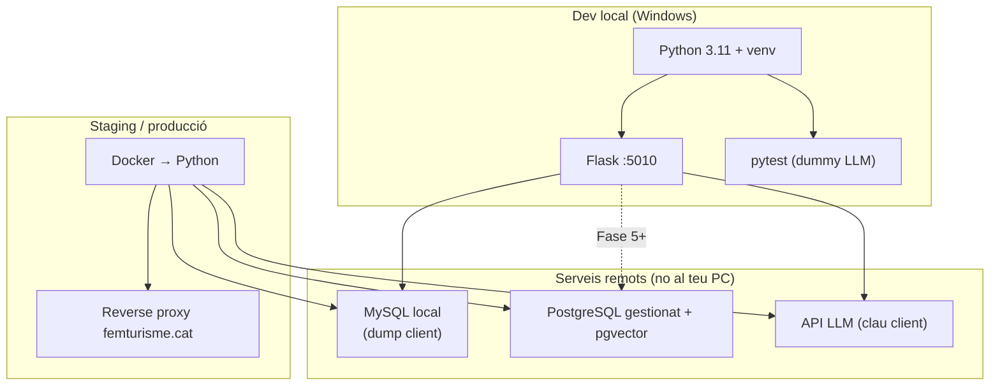

# Desenvolupament local (Windows) — agent_femturisme

Guia completa per treballar al dia a dia **sense Docker** a l'ordinador de desenvolupament. Docker es reserva per **staging i producció** al servidor del client.

**Relacionat:** [testing.md](testing.md) · [checklist-entrega.md](checklist-entrega.md) · [tecnic.md §11](../client/tecnic.md)

---

## Arrancar ràpid

```powershell
python -m venv .venv
.\.venv\Scripts\Activate.ps1
python -m pip install -r requirements.txt
copy .env.example .env
# Edita .env: AGENT_LLM_PROVIDER + API key del client
python main.py
```

| Resultat | URL / comanda |
|----------|----------------|
| Xat demo | http://127.0.0.1:5010 |
| Tests | `python -m pytest -v` |

Configura el **LLM real** al `.env` (API key del client). Veure [§7 Variables d'entorn](#7-variables-dentorn-env).

Primera vegada? Llegeix [§4 Configuració inicial](#4-configuració-inicial-primera-vegada) i [§13 Solució de problemes](#13-solució-de-problemes-windows).

---

## 1. Decisió d'arquitectura

| Entorn | Runtime | On s'executa |
|--------|---------|--------------|
| **Dev local** | Python 3.11 natiu + `venv` | Ordinador del developer (Windows) |
| **Staging / producció** | Docker (només contenidor Python) | Servidor femturisme / infra client |
| **MySQL CMS** | Dump local al PC (copia del client) | Staging/replica read-only al servidor |
| **PostgreSQL (RAG)** | Servei gestionat extern | Plataforma cloud (no al PC local) |

**Per què no Docker en dev local**

- Docker Desktop consumeix molts recursos i pot inestabilitzar l'ordinador de desenvolupament.
- El codi Flask ja funciona directament amb Python; Docker no aporta res imprescindible per programar i fer tests.
- Els fitxers `Dockerfile` i `docker-compose.yml` **es mantenen al repo** com a contracte de desplegament (checklist DEV-100, DEV-108).

**Principi:** *mateix codi, dos runtimes*. El que passes a staging/prod dins Docker ha de funcionar igual amb `python main.py` en local.

---

## 2. Diagrama d'entorns



---

## 3. Requisits al PC

| Requisit | Versió / nota |
|----------|----------------|
| Windows | 10 o 11 |
| Python | **3.11** (mateixa major que `Dockerfile`) |
| Git | Per clonar i sincronitzar |
| Editor | VS Code / Cursor |
| Docker | **No cal** en dev local |
| MySQL local | **Recomanat** — dump del client (sense Docker) | Veure [§9](#9-mysql-en-dev-còpia-local-del-client) |
| PostgreSQL local | **No cal** — Fase 1 xat públic sense RAG |

Comprovar Python:

```powershell
python --version
# Ha de mostrar Python 3.11.x
```

Si `python` no funciona, prova `py -3.11`.

---

## 4. Configuració inicial (primera vegada)

Des de l'arrel del repo (`agent_femturisme`):

```powershell
# 1. Entorn virtual (recomanat; no versionar .venv/)
python -m venv .venv
.\.venv\Scripts\Activate.ps1

# 2. Dependències
python -m pip install --upgrade pip
python -m pip install -r requirements.txt
# Inclou PyMySQL i psycopg2-binary (Fase 3+: repositories MySQL/PostgreSQL; no cal BD local a Fase 1)

# 3. Variables d'entorn
copy .env.example .env
# Edita .env amb un editor de text
```

**Activar el venv en sessions noves:**

```powershell
cd C:\Users\...\agent_femturisme
.\.venv\Scripts\Activate.ps1
```

El prompt hauria de mostrar `(.venv)`.

---

## 5. Arrencar l'agent en local

### Opció A — `main.py` (recomanada)

```powershell
python main.py
```

- Port per defecte: **5010** (`PORT` al `.env` o variable d'entorn).
- `debug=True`, `threaded=True` (veure `main.py`).
- Carrega `.env` automàticament (`python-dotenv`).

### Opció B — Flask CLI

```powershell
$env:FLASK_APP = "main.py"
$env:FLASK_ENV = "development"
python -m flask run --port 5010
```

### Provar el xat

| Recurs | URL |
|--------|-----|
| UI demo integrada | http://127.0.0.1:5010/ |
| API xat (SSE) | `POST http://127.0.0.1:5010/api/chat` |
| Reset sessió | `POST http://127.0.0.1:5010/api/session/reset` |
| Health (pendent DEV-103) | `GET http://127.0.0.1:5010/health` |

Exemple ràpid amb PowerShell:

```powershell
Invoke-RestMethod -Uri http://127.0.0.1:5010/api/session/reset -Method POST -ContentType "application/json" -Body '{"session_id":"dev"}'
```

Per al stream SSE, usa el widget a `/` o `curl.exe -N` (veure [agente.md](../agente.md)).

### Emmagatzematge PDFs (RAG Fase 5)

Per defecte en dev local: **`STORAGE_BACKEND=local`** → fitxers a `data/guides/{doc_id}/original.pdf`.

Per Supabase Storage (mateix projecte que `POSTGRES_*`):

1. Dashboard Supabase → **Storage** → crear bucket privat **`guides`**.
2. **Settings → S3 access keys** → generar clau (no commitar).
3. Al `.env` local (gitignore):

```env
STORAGE_BACKEND=s3
S3_ENDPOINT=https://<project-ref>.storage.supabase.co/storage/v1/s3
S3_REGION=eu-central-1
S3_BUCKET=guides
S3_ACCESS_KEY_ID=...
S3_SECRET_ACCESS_KEY=...
```

4. Verificar: pujar PDF des de `/admin/guides/upload` i comprovar l'objecte al dashboard Storage.
5. Tests opt-in: `python -m pytest tests/integration/rag/test_s3_storage.py -v -m s3`

Veure [runbook-rag-admin.md](runbook-rag-admin.md) i [tecnic.md §7.3](../client/tecnic.md).

---

## 6. Ports: dev vs Docker

| Entorn | Port | Fitxer / origen |
|--------|------|-----------------|
| **Dev local** | **5010** | `main.py` → `PORT` (default 5010) |
| **Docker** | **5080** | `Dockerfile`, `docker-compose.yml` |

No és un error: són dos entorns diferents. En dev local treballa amb **5010**. Quan el client desplegui Docker, el proxy apuntarà al **5080** del contenidor (o el port que defineixin a staging).

---

## 7. Variables d'entorn (`.env`)

Plantilla: `.env.example`. El codi llegeix variables amb prefix opcional `AGENT_` (veure `app/config.py`) — p.ex. `AGENT_MYSQL_HOST` o `MYSQL_HOST`.

### 7.1 LLM en dev local (recomanat)

En local podeu usar el **mateix provider i API key del client** que en staging/producció. Això és el flux normal de desenvolupament: el xat respon amb el LLM real i crida tools com tocarà en producció.

```env
AGENT_SECRET_KEY=dev-local-change-me
AGENT_LLM_PROVIDER=anthropic
AGENT_ANTHROPIC_API_KEY=sk-ant-...
AGENT_ANTHROPIC_MODEL=claude-haiku-4-5-20251001
AGENT_MAX_TOOL_ITERATIONS=5
```

| Provider | Variables |
|----------|-----------|
| Anthropic | `AGENT_LLM_PROVIDER=anthropic` + `AGENT_ANTHROPIC_API_KEY` |
| OpenAI | `AGENT_LLM_PROVIDER=openai` + `AGENT_OPENAI_API_KEY` |
| Gemini | `AGENT_LLM_PROVIDER=gemini` + `AGENT_GEMINI_API_KEY` |

**Seguretat:** la clau va **només** al `.env` (gitignored). No la commitis ni la posis al repo.

### 7.2 Mode `dummy` (només tests automàtics)

`AGENT_LLM_PROVIDER=dummy` simula respostes i crides a tools per paraules clau. **No cal** per arrencar `python main.py` si tens API key.

S'usa automàticament a `pytest` via `TestingConfig` (sense xarxa externa ni cost d'API). Per provar el xat manualment, usa el provider real del [§7.1](#71-llm-en-dev-local-recomanat).

### 7.3 MySQL (Fase 3 — buscadors)

Un sol conjunt de variables `MYSQL_*` actiu al `.env`. Plantilla amb dos entorns a [`.env.example`](../../.env.example):

| Entorn | Quan | `MYSQL_HOST` típic |
|--------|------|---------------------|
| **dev** | Ara — còpia producció a **Railway** | host Railway (remot) |
| **prod** | Staging/producció del **client** | host client (encara sense accés dev) |
| **local** | Dump importat al PC (alternativa) | `127.0.0.1` |

**Dev (Railway)** — copia les variables del panell Railway → servei MySQL:

```env
MYSQL_HOST=<host Railway>
MYSQL_PORT=<port assignat — sovint ≠ 3306>
MYSQL_USER=<usuari>
MYSQL_PASSWORD=<password>
MYSQL_DATABASE=<nom BD>
MYSQL_CONNECT_TIMEOUT=15
```

**Prod (client)** — quan tinguin accés read-only:

```env
MYSQL_HOST=<host staging o prod client>
MYSQL_PORT=3306
MYSQL_USER=agent_read
MYSQL_PASSWORD=<secret client>
MYSQL_DATABASE=femturisme
MYSQL_CONNECT_TIMEOUT=5
```

També vàlid amb prefix `AGENT_` (ex. `AGENT_MYSQL_HOST`). Timeouts per defecte: 5 s (15 s recomanat per Railway).

**Important:** usuari **només lectura** (`SELECT`). L'agent no escriu al CMS.

Verificació:

```powershell
python scripts/test_sql_queries.py --ping
python -m pytest -m integration -v
```

Dump local al PC: [§9](#9-mysql-en-dev-còpia-local-del-client) (alternativa si no uses Railway).

### 7.4 PostgreSQL (Fase 5 — RAG / admin)

```env
POSTGRES_HOST=db.example.neon.tech
POSTGRES_PORT=5432
POSTGRES_USER=...
POSTGRES_PASSWORD=...
POSTGRES_DATABASE=agent_femturisme
POSTGRES_CONNECT_TIMEOUT=5
```

Prefix `AGENT_POSTGRES_*` alternatiu. Base per defecte segons [tecnic.md §10.2](../client/tecnic.md). Instància gestionada amb extensió **pgvector** (Neon, Supabase, Railway…); no cal instal·lar PostgreSQL al Windows de dev.

**Primera vegada (DEV-500):**

1. Crea projecte cloud amb pgvector habilitat (Supabase: Database → Extensions → **vector**).
2. Afegeix les variables al `.env`.
3. **Supabase des de Windows:** si el host directe `db.<project>.supabase.co:5432` falla (firewall), usa el **pooler Session mode**:

```env
POSTGRES_HOST=aws-0-eu-central-1.pooler.supabase.com
POSTGRES_PORT=6543
POSTGRES_USER=postgres.<project-ref>
POSTGRES_SSLMODE=require
```

(`sslmode=require` s'aplica automàticament si el host conté `supabase.co`.)

4. Aplica el schema:

```powershell
python scripts/apply_postgres_schema.py
python -m pytest tests/integration/postgres/test_schema.py -v -m integration
python scripts/test_sql_queries.py --ping
```

El script és **idempotent** (segur de re-executar). DDL font: [schema-agent-postgres.sql](../schema-agent-postgres.sql).

### 7.5 Què cal per fase

| Fase | `.env` necessari en local |
|------|---------------------------|
| Agent + xat manual | `AGENT_*` + provider real + API key client |
| `pytest` (automàtic) | `TestingConfig` → `dummy` (no cal canviar el teu `.env`) |
| Fase 2–3 MySQL | + `MYSQL_*` → **dev Railway** o dump local `127.0.0.1` |
| Fase 4 widget PHP | Agent en `:5010`; proxy PHP a staging |
| Fase 5 RAG | + `POSTGRES_*` (cloud) |
| Fase 1 producte xat | **Sense** PostgreSQL obligatori |

---

## 8. Tests (sense Docker)

Veure [testing.md](testing.md). Resum:

```powershell
# Assegura't que el venv està actiu
python -m pytest -v

# Integració SQL (salta sense MYSQL_*)
python -m pytest -m integration -v

# Schema PostgreSQL RAG (salta sense POSTGRES_*; cal apply_postgres_schema.py abans)
python scripts/apply_postgres_schema.py
python -m pytest tests/integration/postgres/test_schema.py -v -m integration

# Ping MySQL (esquelet Fase 3)
python scripts/test_sql_queries.py --ping
```

| Comanda | Què executa | MySQL |
|---------|-------------|-------|
| `pytest -v` | API-01…04 + unit | No |
| `pytest -m integration -v` | SQL-01…07 placeholders | Skip si no configurat |
| `pytest -m "not integration"` | Per defecte (`pytest.ini`) | No |

Els tests usen `TestingConfig`: `LLM_PROVIDER=dummy`, sense xarxa externa.

---

## 9. MySQL en dev: Railway o còpia local

Estratègies per treballar amb dades reals sense accés directe al MySQL de producció del client:

| Estratègia | Estat actual | `.env` |
|------------|--------------|--------|
| **Railway** (còpia producció) | Recomanada ara | `MYSQL_HOST` = host Railway — veure [§7.3](#73-mysql-fase-3--buscadors) |
| **Dump local** | Alternativa | `MYSQL_HOST=127.0.0.1` — import al PC |
| **Staging client** | Prod — pendent accés | `MYSQL_HOST` remot quan obtinguin credencials |

Si **no pots connectar** des del teu PC al MySQL real del client (firewall, VPN, política de xarxa), l'estratègia clàssica era:

1. El client et proporciona una **còpia** de la base de dades (estructura + dades).
2. Instal·les **MySQL natiu a Windows** (sense Docker).
3. Importes el dump i desenvolupes contra `127.0.0.1`.
4. Staging/producció segueixen usant el MySQL del client al servidor.

Això desbloqueja Fase 2–3 (`sql-mapeo.md`, repositories, `pytest -m integration`) sense dependre de xarxa.

### 9.1 Què demanar al client

| Entregable | Checklist | Notes |
|------------|-----------|-------|
| `schema.sql` (estructura) | DEV-020 | [`docs/schema.sql`](../schema.sql) — rebut 2026-07-07 |
| Dump de dades (`.sql` o `.sql.gz`) | DEV-022 (dev local) | Preferible **mostra anonimitzada** si hi ha dades personals |
| Versió MySQL del servidor | — | Ex.: 8.0.x — instal·la la mateixa major al PC |
| Definició usuari `agent_read` | DEV-021 | `GRANT SELECT` — el recrees en local |
| Respostes Q-01…Q-08 | DEV-024 | Taules, URLs, publicació, idiomes |

**Si el dump és massa gran**, demana un subconjunt vàlid per provar els 6 buscadors (p. ex. una comarca, registres publicats, múltiples idiomes).

**Privacitat:** el dump és **només per dev local**; no el commitis al repo (afegeix `*.sql.gz`, `data/mysql/` al `.gitignore` si cal).

### 9.2 Instal·lar MySQL a Windows (sense Docker)

1. Descarrega [MySQL Community Server 8.0](https://dev.mysql.com/downloads/mysql/) (instal·lador Windows).
2. Durante la instal·lació: port **3306**, usuari `root` amb contrasenya local.
3. Opcional: MySQL Workbench per importar visualment.

Alternativa lleugera: **MariaDB** (compatible amb la majoria de dumps MySQL 8).

### 9.3 Importar el dump

```powershell
# Crear base de dades
mysql -u root -p -e "CREATE DATABASE femturisme CHARACTER SET utf8mb4 COLLATE utf8mb4_unicode_ci;"

# Importar (ajusta el path del fitxer)
mysql -u root -p femturisme < C:\ruta\dump_femturisme.sql

# Usuari read-only (com producció)
mysql -u root -p -e "CREATE USER 'agent_read'@'localhost' IDENTIFIED BY 'dev-local'; GRANT SELECT ON femturisme.* TO 'agent_read'@'localhost'; FLUSH PRIVILEGES;"
```

Dump comprimit:

```powershell
# .gz — amb 7-Zip o gzip de Git Bash
gzip -dc dump.sql.gz | mysql -u root -p femturisme
```

### 9.4 `.env` per dev local

```env
MYSQL_HOST=127.0.0.1
MYSQL_PORT=3306
MYSQL_USER=agent_read
MYSQL_PASSWORD=dev-local
MYSQL_DATABASE=femturisme
```

Verificar (quan existeixi `connection.py`):

```powershell
python scripts/test_sql_queries.py --ping
python -m pytest -m integration -v
```

### 9.5 Mantenir la còpia al dia

| Situació | Acció |
|----------|--------|
| Canvi de schema al CMS | Demana nou `schema.sql` + dump incremental o complet |
| Queries noves a `sql-mapeo.md` | Reimportar si cal columnes noves |
| Pre-UAT | Validar també contra **staging remot** del client (si obren accés puntual) |

### 9.6 Alternatives (menys habituals aquí)

| Opció | Quan |
|-------|------|
| Accés directe staging | Firewall obert a la teva IP — `MYSQL_HOST` remot |
| Túnel SSH | Bastion del client — veure §9.6 legacy a continuació |
| Docker MySQL | **Evitar** al teu PC (mateix motiu que Docker Desktop) |

<details>
<summary>Túnel SSH (si algun dia obren bastion, no cal per defecte)</summary>

```powershell
ssh -L 3307:mysql-staging.internal:3306 usuari@bastion.femturisme.cat
```

```env
MYSQL_HOST=127.0.0.1
MYSQL_PORT=3307
```

</details>

### 9.7 Què no fer

- No commitir dumps amb dades reals al repo Git.
- No usar scraping legacy com a substitut quan ja tens MySQL local.
- No donar permisos d'escriptura a `agent_read` (ni en local): mantén `SELECT` only com producció.

---

## 10. Docker: quan i on s'usa

| Acció | Dev local | Staging / prod |
|-------|-----------|----------------|
| Programar Flask / tools | ✅ `python main.py` | — |
| `pytest` | ✅ | Opcional CI cloud |
| `docker compose up` | ❌ **No requerit** | ✅ Servidor client |
| Verificar imatge | — | `docker build` al servidor o CI |
| DEV-108 checklist | — | Servei accessible + `/health` |

Fitxers de desplegament (referència, no executar en dev):

- `Dockerfile` — Python 3.11-slim, port 5080
- `docker-compose.yml` — mapeig `5080:5080`, `env_file: .env`

El contenidor Docker **només empaqueta Python**. PostgreSQL va **fora** del Docker de producció ([tecnic.md §11](../client/tecnic.md)).

---

## 11. Flux de treball diari

```text
1. Activar venv
2. git pull
3. python -m pip install -r requirements.txt   (si requirements canviat)
4. python -m pytest -v                          (abans/després de canvis)
5. python main.py                               (provar manualment)
6. Commit / PR → staging desplegat amb Docker pel client o CI
```

Per cada feature:

1. Llegir domini + checklist `DEV-xxx` obert ([index.md](index.md)).
2. Implementar + tests.
3. Marcar checklist si el criteri **Detect** es compleix.
4. La validació «com en producció» es fa a **staging Docker**, no al PC local.

---

## 12. Matriu dev local vs staging/producció

| Aspecte | Dev local (Windows) | Staging / prod (Docker) |
|---------|---------------------|-------------------------|
| Runtime | Python + venv | Imatge `Dockerfile` |
| Port app | 5010 | 5080 (compose actual) |
| MySQL | Dump local `127.0.0.1` (copia client) | MySQL real staging/prod |
| PostgreSQL | URL cloud o omit (F1) | Instància gestionada |
| LLM | Provider real + clau client | Mateix provider al `.env` staging |
| Historial xat | Memòria (`agent_service`) | Mateix v1; Redis/DB si escala |
| Scraping legacy | Evitar | No en producció |
| Tests automàtics | `pytest` al PC | Recomanable CI (GitHub Actions) |

---

## 13. Solució de problemes (Windows)

### `pip` o `pytest` no reconegut

Usa el mòdul Python explícit (no cal tenir Scripts al PATH):

```powershell
python -m pip install -r requirements.txt
python -m pytest -v
```

### Error en activar venv (ExecutionPolicy)

```powershell
Set-ExecutionPolicy -Scope CurrentUser RemoteSigned
.\.venv\Scripts\Activate.ps1
```

### `ModuleNotFoundError: flask`

Venv no actiu o deps no instal·lades:

```powershell
.\.venv\Scripts\Activate.ps1
python -m pip install -r requirements.txt
```

### El xat no crida tools

- Comprova que `AGENT_LLM_PROVIDER` i la API key al `.env` són correctes.
- Revisa la pregunta: el LLM ha de triar la tool adequada (veure [agente.md](../agente.md)).
- Si estàs en mode `dummy` (només tests), cal paraules clau com «rutes», «hotel», «event».

### Error d'autenticació LLM (401 / invalid API key)

- Verifica la clau al `.env` (sense espais ni cometes extra).
- Confirma que el provider coincideix (`anthropic` vs `openai` vs `gemini`).

### Port 5010 ocupat

```powershell
$env:PORT = "5011"
python main.py
```

### Docker no cal per resoldre errors de dev

Si un test passa en local però falla a staging, revisa `.env` de staging, xarxa MySQL i versió Python (3.11).

---

## 14. CI futur (opcional, sense Docker al PC)

Es pot afegir GitHub Actions que:

1. `pip install -r requirements.txt`
2. `pytest -v`
3. `docker build` (només a la nube del runner)

Això valida la imatge **sense** executar Docker Desktop al teu ordinador.

---

## 15. Referències

| Document | Contingut |
|----------|-----------|
| [testing.md](testing.md) | pytest, API-01…04, SQL-01…07 |
| [checklist-entrega.md](checklist-entrega.md) | Passos DEV-xxx |
| [tecnic.md §10–11](../client/tecnic.md) | Variables entorn, Docker producció |
| [pla-integracio-resum-ca.md](../pla-integracio-resum-ca.md) | PostgreSQL extern vs Docker |
| [agente.md](../agente.md) | Bucle agent, esdeveniments SSE |
| [AGENTS.md](../../AGENTS.md) | Mapa docs per agents |

---

## 16. Resum en una línia

**Desenvolupa amb Python natiu al Windows; MySQL amb còpia local del client; Docker només staging/producció.**
