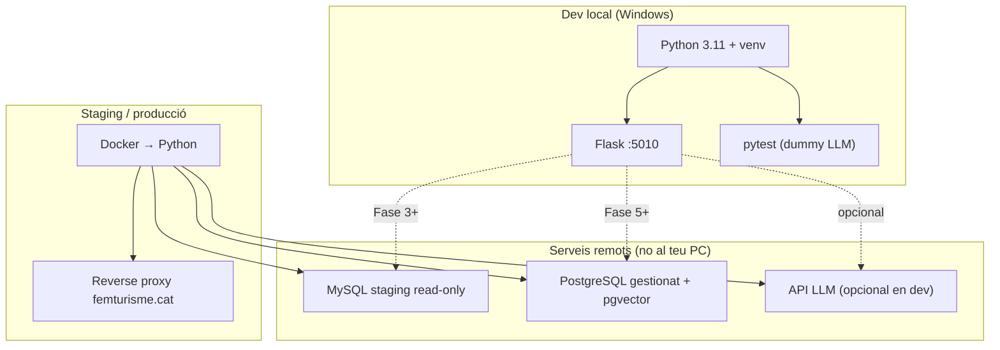

# Desenvolupament local (Windows) — agent_femturisme

Guia completa per treballar al dia a dia **sense Docker** a l'ordinador de desenvolupament. Docker es reserva per **staging i producció** al servidor del client.

**Relacionat:** [testing.md](testing.md) · [checklist-entrega.md](checklist-entrega.md) · [tecnic.md §11](../client/tecnic.md)

---

## 1. Decisió d'arquitectura

| Entorn | Runtime | On s'executa |
|--------|---------|--------------|
| **Dev local** | Python 3.11 natiu + `venv` | Ordinador del developer (Windows) |
| **Staging / producció** | Docker (només contenidor Python) | Servidor femturisme / infra client |
| **MySQL CMS** | Servei remot | Staging/replica read-only del client |
| **PostgreSQL (RAG)** | Servei gestionat extern | Plataforma cloud (no al PC local) |

**Per què no Docker en dev local**

- Docker Desktop consumeix molts recursos i pot inestabilitzar l'ordinador de desenvolupament.
- El codi Flask ja funciona directament amb Python; Docker no aporta res imprescindible per programar i fer tests.
- Els fitxers `Dockerfile` i `docker-compose.yml` **es mantenen al repo** com a contracte de desplegament (checklist DEV-100, DEV-108).

**Principi:** *mateix codi, dos runtimes*. El que passes a staging/prod dins Docker ha de funcionar igual amb `python main.py` en local.

---

## 2. Diagrama d'entorns



---

## 3. Requisits al PC

| Requisit | Versió / nota |
|----------|----------------|
| Windows | 10 o 11 |
| Python | **3.11** (mateixa major que `Dockerfile`) |
| Git | Per clonar i sincronitzar |
| Editor | VS Code / Cursor |
| Docker | **No cal** en dev local |
| MySQL local | **No cal** — s'usa staging remot |
| PostgreSQL local | **No cal** — Fase 1 xat públic sense RAG |

Comprovar Python:

```powershell
python --version
# Ha de mostrar Python 3.11.x
```

Si `python` no funciona, prova `py -3.11`.

---

## 4. Configuració inicial (primera vegada)

Des de l'arrel del repo (`agent_femturisme`):

```powershell
# 1. Entorn virtual (recomanat; no versionar .venv/)
python -m venv .venv
.\.venv\Scripts\Activate.ps1

# 2. Dependències
python -m pip install --upgrade pip
python -m pip install -r requirements.txt

# 3. Variables d'entorn
copy .env.example .env
# Edita .env amb un editor de text
```

**Activar el venv en sessions noves:**

```powershell
cd C:\Users\...\agent_femturisme
.\.venv\Scripts\Activate.ps1
```

El prompt hauria de mostrar `(.venv)`.

---

## 5. Arrencar l'agent en local

### Opció A — `main.py` (recomanada)

```powershell
python main.py
```

- Port per defecte: **5010** (`PORT` al `.env` o variable d'entorn).
- `debug=True`, `threaded=True` (veure `main.py`).
- Carrega `.env` automàticament (`python-dotenv`).

### Opció B — Flask CLI

```powershell
$env:FLASK_APP = "main.py"
$env:FLASK_ENV = "development"
python -m flask run --port 5010
```

### Provar el xat

| Recurs | URL |
|--------|-----|
| UI demo integrada | http://127.0.0.1:5010/ |
| API xat (SSE) | `POST http://127.0.0.1:5010/api/chat` |
| Reset sessió | `POST http://127.0.0.1:5010/api/session/reset` |
| Health (pendent DEV-103) | `GET http://127.0.0.1:5010/health` |

Exemple ràpid amb PowerShell:

```powershell
Invoke-RestMethod -Uri http://127.0.0.1:5010/api/session/reset -Method POST -ContentType "application/json" -Body '{"session_id":"dev"}'
```

Per al stream SSE, usa el widget a `/` o `curl.exe -N` (veure [agente.md](../agente.md)).

---

## 6. Ports: dev vs Docker

| Entorn | Port | Fitxer / origen |
|--------|------|-----------------|
| **Dev local** | **5010** | `main.py` → `PORT` (default 5010) |
| **Docker** | **5080** | `Dockerfile`, `docker-compose.yml` |

No és un error: són dos entorns diferents. En dev local treballa amb **5010**. Quan el client desplegui Docker, el proxy apuntarà al **5080** del contenidor (o el port que defineixin a staging).

---

## 7. Variables d'entorn (`.env`)

Plantilla: `.env.example`. El codi llegeix variables amb prefix opcional `AGENT_` (veure `app/config.py`).

### 7.1 Mínim per començar (Fase actual)

```env
AGENT_SECRET_KEY=dev-local-change-me
AGENT_LLM_PROVIDER=dummy
AGENT_MAX_TOOL_ITERATIONS=5
```

Amb `dummy` no cal cap API key de LLM. El proveïdor dummy simula crides a tools segons paraules clau (rutes, hotels, events…).

### 7.2 Provar amb LLM real (opcional)

```env
AGENT_LLM_PROVIDER=anthropic
AGENT_ANTHROPIC_API_KEY=sk-ant-...
AGENT_ANTHROPIC_MODEL=claude-haiku-4-5-20251001
```

Alternatives: `openai`, `gemini` (veure `.env.example`).

### 7.3 MySQL staging (Fase 3 — buscadors)

Quan existeixi `app/db/connection.py`:

```env
MYSQL_HOST=mysql-staging.example.com
MYSQL_PORT=3306
MYSQL_USER=agent_read
MYSQL_PASSWORD=...
MYSQL_DATABASE=femturisme
```

O amb prefix `AGENT_MYSQL_*` quan s'unifiqui a `config.py`.

**Important:** usuari **només lectura** (`SELECT`). L'agent no escriu al CMS.

### 7.4 PostgreSQL (Fase 5 — RAG / admin)

```env
POSTGRES_HOST=db.example.neon.tech
POSTGRES_PORT=5432
POSTGRES_USER=...
POSTGRES_PASSWORD=...
POSTGRES_DATABASE=femturisme_agent
```

Instància gestionada amb extensió **pgvector**. No instal·lar PostgreSQL al Windows de dev.

### 7.5 Què cal per fase

| Fase | `.env` necessari en local |
|------|---------------------------|
| Agent + tests (ara) | `AGENT_*` + `dummy` |
| Fase 2–3 MySQL | + `MYSQL_*` (staging remot) |
| Fase 4 widget PHP | Agent en `:5010`; proxy PHP a staging |
| Fase 5 RAG | + `POSTGRES_*` (cloud) |
| Fase 1 producte xat | **Sense** PostgreSQL obligatori |

---

## 8. Tests (sense Docker)

Veure [testing.md](testing.md). Resum:

```powershell
# Assegura't que el venv està actiu
python -m pytest -v

# Integració SQL (salta sense MYSQL_*)
python -m pytest -m integration -v

# Ping MySQL (esquelet Fase 3)
python scripts/test_sql_queries.py --ping
```

| Comanda | Què executa | MySQL |
|---------|-------------|-------|
| `pytest -v` | API-01…04 + unit | No |
| `pytest -m integration -v` | SQL-01…07 placeholders | Skip si no configurat |
| `pytest -m "not integration"` | Per defecte (`pytest.ini`) | No |

Els tests usen `TestingConfig`: `LLM_PROVIDER=dummy`, sense xarxa externa.

---

## 9. Connexió MySQL staging des de Windows

El MySQL del client **no** corre al teu PC. Opcions:

### 9.1 Accés directe (ideal)

Si el firewall permet connexió des de la teva IP → posa `MYSQL_HOST` al `.env` i prova:

```powershell
python scripts/test_sql_queries.py --ping
```

(quan `app/db/connection.py` existeixi).

### 9.2 Túnel SSH (si cal)

Si només accessible des d'un bastion:

```powershell
ssh -L 3307:mysql-staging.internal:3306 usuari@bastion.femturisme.cat
```

Al `.env` en una altra finestra:

```env
MYSQL_HOST=127.0.0.1
MYSQL_PORT=3307
```

Mantén la sessió SSH oberta mentre desenvolupes.

### 9.3 Què no fer

- No instal·lar MySQL local «per tenir dades» — divergeix del schema real del client.
- No usar Docker només per tenir MySQL al PC.
- No executar scraping legacy com a substitut permanent (objectiu v1 = repositories MySQL).

---

## 10. Docker: quan i on s'usa

| Acció | Dev local | Staging / prod |
|-------|-----------|----------------|
| Programar Flask / tools | ✅ `python main.py` | — |
| `pytest` | ✅ | Opcional CI cloud |
| `docker compose up` | ❌ **No requerit** | ✅ Servidor client |
| Verificar imatge | — | `docker build` al servidor o CI |
| DEV-108 checklist | — | Servei accessible + `/health` |

Fitxers de desplegament (referència, no executar en dev):

- `Dockerfile` — Python 3.11-slim, port 5080
- `docker-compose.yml` — mapeig `5080:5080`, `env_file: .env`

El contenidor Docker **només empaqueta Python**. PostgreSQL va **fora** del Docker de producció ([tecnic.md §11](../client/tecnic.md)).

---

## 11. Flux de treball diari

```text
1. Activar venv
2. git pull
3. python -m pip install -r requirements.txt   (si requirements canviat)
4. python -m pytest -v                          (abans/després de canvis)
5. python main.py                               (provar manualment)
6. Commit / PR → staging desplegat amb Docker pel client o CI
```

Per cada feature:

1. Llegir domini + checklist `DEV-xxx` obert ([index.md](index.md)).
2. Implementar + tests.
3. Marcar checklist si el criteri **Detect** es compleix.
4. La validació «com en producció» es fa a **staging Docker**, no al PC local.

---

## 12. Matriu dev local vs staging/producció

| Aspecte | Dev local (Windows) | Staging / prod (Docker) |
|---------|---------------------|-------------------------|
| Runtime | Python + venv | Imatge `Dockerfile` |
| Port app | 5010 | 5080 (compose actual) |
| MySQL | Remot (tunnel si cal) | Xarxa interna client |
| PostgreSQL | URL cloud o omit (F1) | Instància gestionada |
| LLM | `dummy` habitual | Provider real |
| Historial xat | Memòria (`agent_service`) | Mateix v1; Redis/DB si escala |
| Scraping legacy | Evitar | No en producció |
| Tests automàtics | `pytest` al PC | Recomanable CI (GitHub Actions) |

---

## 13. Solució de problemes (Windows)

### `pip` o `pytest` no reconegut

Usa el mòdul Python explícit (no cal tenir Scripts al PATH):

```powershell
python -m pip install -r requirements.txt
python -m pytest -v
```

### Error en activar venv (ExecutionPolicy)

```powershell
Set-ExecutionPolicy -Scope CurrentUser RemoteSigned
.\.venv\Scripts\Activate.ps1
```

### `ModuleNotFoundError: flask`

Venv no actiu o deps no instal·lades:

```powershell
.\.venv\Scripts\Activate.ps1
python -m pip install -r requirements.txt
```

### El xat no crida tools (només text dummy)

- Comprova `AGENT_LLM_PROVIDER=dummy` al `.env`.
- El missatge ha de contenir paraules clau (p. ex. «rutes», «hotel», «event»).
- En tests, API-03 mocka `execute_tool` ([testing.md](testing.md)).

### Port 5010 ocupat

```powershell
$env:PORT = "5011"
python main.py
```

### Docker no cal per resoldre errors de dev

Si un test passa en local però falla a staging, revisa `.env` de staging, xarxa MySQL i versió Python (3.11).

---

## 14. CI futur (opcional, sense Docker al PC)

Es pot afegir GitHub Actions que:

1. `pip install -r requirements.txt`
2. `pytest -v`
3. `docker build` (només a la nube del runner)

Això valida la imatge **sense** executar Docker Desktop al teu ordinador.

---

## 15. Referències

| Document | Contingut |
|----------|-----------|
| [testing.md](testing.md) | pytest, API-01…04, SQL-01…07 |
| [checklist-entrega.md](checklist-entrega.md) | Passos DEV-xxx |
| [tecnic.md §10–11](../client/tecnic.md) | Variables entorn, Docker producció |
| [pla-integracio-resum-ca.md](../pla-integracio-resum-ca.md) | PostgreSQL extern vs Docker |
| [agente.md](../agente.md) | Bucle agent, esdeveniments SSE |
| [AGENTS.md](../../AGENTS.md) | Mapa docs per agents |

---

## 16. Resum en una línia

**Desenvolupa amb Python natiu al Windows; connecta a MySQL/PostgreSQL remots quan calgui; deixa Docker per al servidor de staging/producció.**
