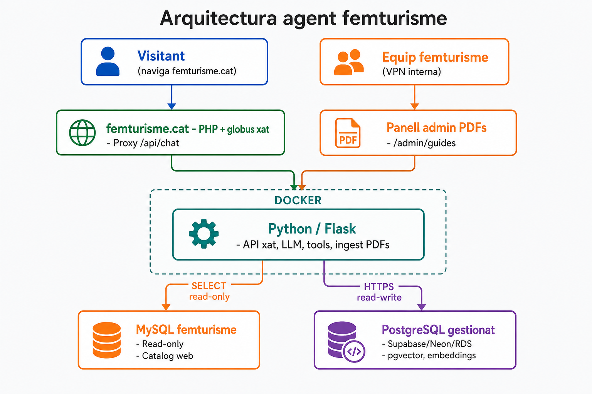

# Plan de integración — resumen para el equipo

Documento corto. El plan detallado por fases está en `plan-integracion.md` (referencia técnica).

---

## ¿Qué construimos?

Un **chat en femturisme.cat** (globo flotante) que responde preguntas sobre:

1. **Catálogo** — ofertas, alojamientos, agenda, rutas (datos de la web, vía MySQL).
2. **Guías PDF** — folletos municipales indexados (vía PostgreSQL + vectores).

Un solo chat para el usuario. Detrás hay un **servicio Python** con LLM y tools.

---

## Arquitectura en una imagen



**Archivo para Google Docs:** `docs/assets/diagrama-arquitectura.png`

**Recomendado:** PostgreSQL **gestionado por plataforma externa**. El Docker del agente solo lleva el **Python**.

---

## Dos bases de datos — respuesta directa

| | **MySQL femturisme** | **PostgreSQL agent** |
|---|----------------------|----------------------|
| **¿Ya existe?** | Sí (la web actual) | **No — hay que crearla** |
| **¿Dónde vive?** | Servidor femturisme (como ahora) | **Plataforma externa** (recomendado) o Docker solo en dev local |
| **¿Read/write?** | **Solo lectura** (`agent_read`) | **Lectura y escritura** (`agent_app`) |
| **¿Para qué?** | Tools de catálogo (4 búsquedas SQL) | PDFs subidos, estado indexación, embeddings |
| **¿Quién escribe?** | El CMS PHP (como siempre) | **Solo el servicio Python** |

**No mezclamos nada:** la MySQL de femturisme no guarda PDFs ni vectores. La PostgreSQL del agente no toca el catálogo de la web.

---

## PostgreSQL: Docker vs plataforma externa

| | **PostgreSQL en Docker** | **PostgreSQL gestionado (recomendado)** |
|---|--------------------------|----------------------------------------|
| **Backups** | Hay que configurarlos vosotros | Automáticos desde el panel |
| **Monitoring / alertas** | Hay que montarlo | Incluido o integrado |
| **pgvector** | Imagen `pgvector/pgvector` | Verificar que el proveedor lo soporta |
| **Staging + producción** | Dos contenedores / manual | Dos proyectos o instancias desde el panel |
| **Quién lo gestiona** | Ops + dev (servidor) | Equipo vía web del proveedor + credenciales en `.env` |
| **Mejor para** | Dev local, prueba rápida | **Staging y producción** |

**Recomendación v1:** Python en Docker de vuestro servidor; PostgreSQL en servicio gestionado. El Python solo necesita la **URL de conexión** en `.env`.

**Ejemplos:** Supabase, Neon, AWS RDS (elegir uno en Fase 0; hace falta **pgvector**).

---

## Docker — qué hay dentro

**Staging / producción (recomendado):** solo `agent` (Python). PostgreSQL = URL externa en `.env`.

**Dev local (opcional):** `agent` + `postgres` (pgvector).

- **MySQL** fuera del Docker; el Python conecta por red (VPN/firewall)
- **PDFs** en disco del servidor agent (`data/guides/`), no dentro de PostgreSQL

---

## Qué hace cada pieza

| Pieza | Rol |
|-------|-----|
| **femturisme.cat (PHP)** | Web pública. Globo chat. Proxy `/api/chat` al Python. **No** sube PDFs. **No** ejecuta el LLM. |
| **Python (agente)** | LLM, tools, API chat, panel admin PDFs, pipeline ingest + embeddings. |
| **MySQL** | Fuente de verdad del catálogo (misma BD que la web). |
| **PostgreSQL** | Fuente de verdad de guías PDF y vectores. |

---

## Dos frontends (no uno)

| Quién | Dónde | Qué hace |
|-------|-------|----------|
| Visitante | femturisme.cat | Chat turístico |
| Equipo femturisme | `https://<agent>/admin/guides` (VPN/interno) | Subir PDFs, ver si están indexados |

El Python **tiene un frontend pequeño** solo para administración de PDFs. No es una segunda web pública.

---

## ¿Cómo se suben los PDFs?

1. Entrar al panel admin (URL interna del servicio Python).
2. Rellenar: archivo PDF + municipio + título.
3. Clic «Subir» → Python guarda el archivo y arranca el pipeline automático.

**Alternativa dev:** `python scripts/ingest_pdf.py --file guia.pdf --municipality Berga`

### ¿Dónde se guarda el PDF? (¿hace falta?)

**Sí, hay que guardarlo.** Al subir se guardan **tres cosas** en sitios distintos:

| Qué | Dónde | Para qué |
|-----|-------|----------|
| **PDF original** (`.pdf`) | Disco del servidor agent: `data/guides/{doc_id}/original.pdf` | Fuente original; reindexar si cambia el modelo; auditar; descargar |
| **Metadatos y estado** | PostgreSQL (`guide_documents`) | Título, municipio, status, errores, contadores |
| **Texto + vectores** | PostgreSQL (pgvector) | Búsqueda RAG en el chat |

El PDF **no** va dentro de PostgreSQL. **No** va a MySQL femturisme.

**Backups:** incluir `data/guides/` **y** PostgreSQL.

---

## ¿Cómo sabemos qué PDFs hay y si el embedding fue bien?

En el panel admin se ve una **tabla** con cada documento:

| Campo visible | Ejemplo |
|---------------|---------|
| Título / municipio | Guia Berga 2024 — Berga |
| **Estado** | `indexed` ✅ o `failed` ❌ |
| Páginas / chunks | 48 páginas, 120 chunks |
| Embeddings | 120/120 (debe coincidir) |
| Error | (vacío si todo OK) |

**Estados:**

- `pending` → `extracting` → `chunking` → `embedding` → **`indexed`**
- Si falla → **`failed`** + mensaje de error + botón «Reindexar»

**Ha ido bien cuando:** `status = indexed` y `embeddings = chunks` (todos).

**Prueba rápida:** botón «Probar búsqueda» en el panel, o preguntar al chat: *«¿Dónde comer en Berga según la guía?»*

---

## ¿Cómo funciona el catálogo (MySQL)?

El LLM **no escribe SQL libre**. Elige una tool con parámetros:

```
Usuario: "Actividades familiares en el Berguedà"
    → search_experiences(destination="Berguedà", category="Familiar")
    → Python ejecuta SQL fija (revisada por devs)
    → JSON con resultados → LLM responde
```

¿Por qué no SQL al vuelo? Seguridad, schema legacy, resultados estables, tests. Detalle: `plan-integracion.md` Anexo D.

---

## Qué hace falta antes de programar (Fase 0)

Checklist mínimo para ops + dev:

- [ ] Usuario MySQL `agent_read` (solo SELECT)
- [ ] `docs/schema.sql` exportado y commiteado (estructura MySQL, sin datos)
- [ ] Docker con Python + PostgreSQL en **staging**
- [ ] Credenciales en `.env` (MySQL + PostgreSQL)
- [ ] Red: contenedor Python → MySQL femturisme
- [ ] Red: femturisme.cat (proxy) → contenedor Python

---

## Fases (una línea cada una)

| # | Qué |
|---|-----|
| 0 | Infra: MySQL read-only, Docker Python+PostgreSQL, `.env` |
| 1 | Python desplegado, `/api/chat` funciona |
| 2 | Documentar SQL para las 4 tools de catálogo |
| 3 | Implementar tools catálogo contra MySQL |
| 4 | Globo chat en femturisme.cat |
| 5 | Panel admin PDFs + pipeline embeddings |
| 6 | Tool RAG (búsqueda en guías) |
| 7 | Un solo chat: catálogo + guías juntos |
| 8 | Producción: logs, límites, backups |

Las fases 2–3 (SQL) y 5 (PDFs) pueden ir **en paralelo** una vez 0–1 están listas.

---

## Decisiones tomadas

| Tema | Decisión |
|------|----------|
| ¿Chat dónde? | Embebido en femturisme.cat (mismo dominio) |
| ¿Agente dónde? | Servidor propio, Docker |
| Catálogo | MySQL read-only, tools SQL parametrizadas |
| Guías PDF | PostgreSQL gestionado (externo) + pgvector; Python en Docker |
| Subida PDFs | Panel admin en Python (interno), no en PHP |
| SQL al vuelo por LLM | **No** en v1 |

---

## Preguntas frecuentes (respuestas cortas)

**¿El PHP tiene que cambiar mucho?**  
Globo + proxy al Python. Nada de PDFs ni LLM en PHP.

**¿Hay que tocar la MySQL de producción?**  
Solo crear un usuario read-only. Sin escritura desde el agente.

**¿Dónde se despliega el Docker?**  
Servidor acordado con ops (puede ser el mismo host que PHP o uno dedicado). Hace falta acceso desde femturisme.cat al puerto del agente.

**¿Qué es `docs/schema.sql`?**  
Volcado de la estructura MySQL (CREATE TABLE), sin datos. Va al repo del agente para que los devs vean tablas sin conectar a producción.

**¿Y si un PDF falla?**  
Se ve `failed` en el panel, se lee el error, se pulsa Reindexar.

---

## Siguiente paso concreto

1. Ops: usuario MySQL read-only + máquina staging para Docker.
2. Dev: `docker-compose up` con Python + PostgreSQL.
3. Dev: primera conexión MySQL + primera tool de catálogo (`search_experiences`).
