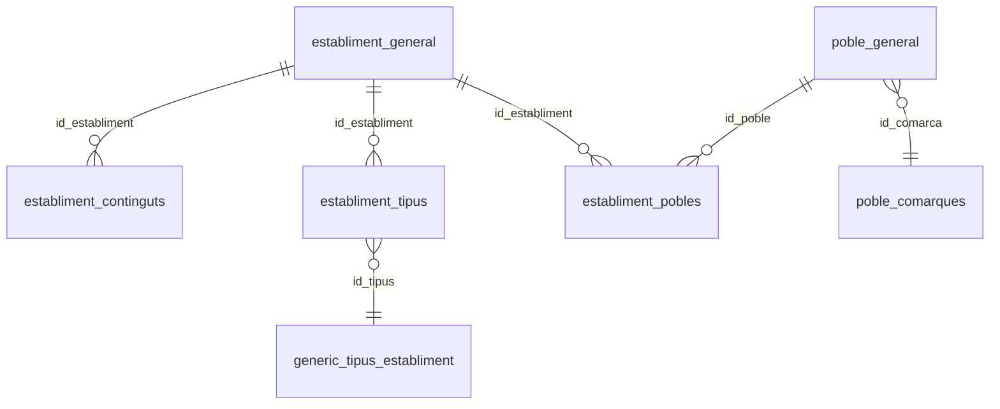
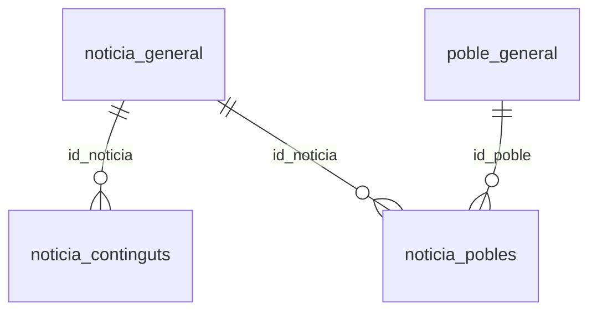
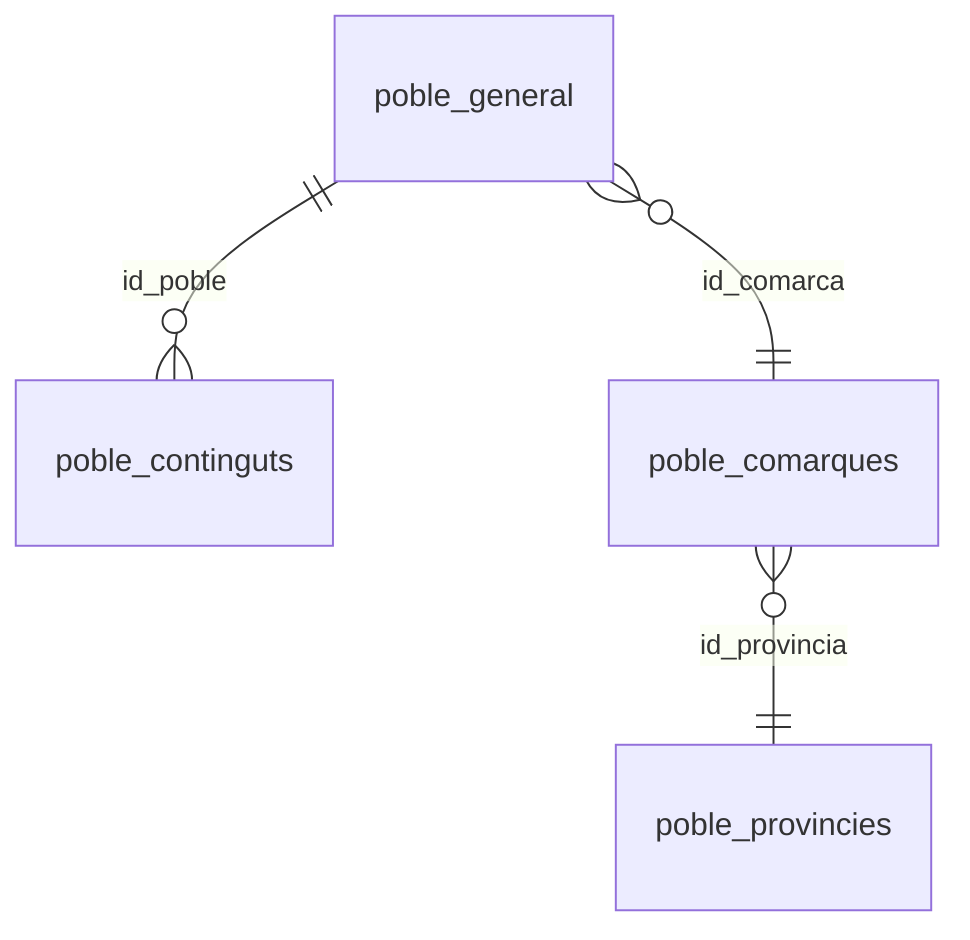
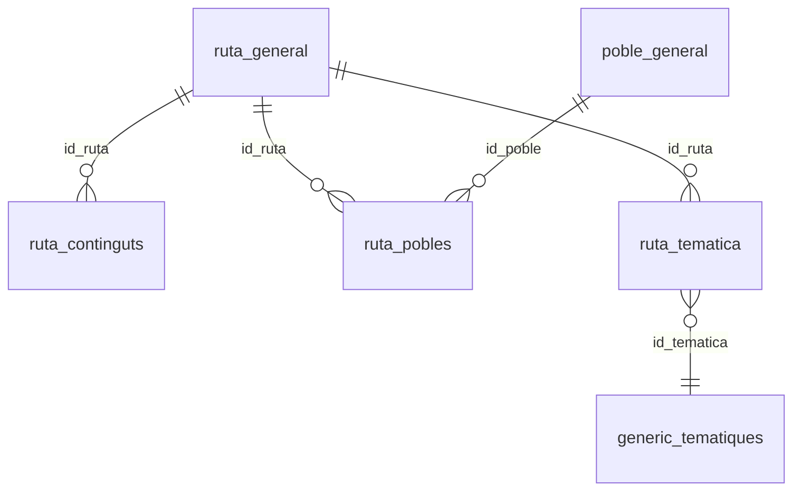
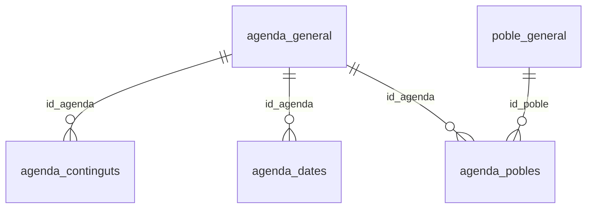
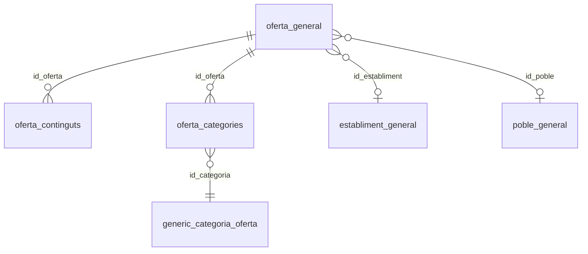

# sql-mapeo.md — Queries MySQL per buscadors de catàleg (v1.1)

Document de **Fase 2**. Omplir abans d'implementar repositoris a Fase 3.

**Domini:** [dominio-femturisme-ca.md](client/dominio-femturisme-ca.md)  
**Schema:** [schema.sql](schema.sql) (MariaDB 10.3.39, export client 2026-07-07)  
**Estat:** ☑ esborrany schema · ☑ SQL provada amb dump *(2026-07-20, Railway dev; `pytest tests/integration/sql/` 14/14)* · ☐ revisat client

---

## Metadades del schema

| Camp | Valor |
|------|-------|
| Motor | MariaDB **10.3.39** (instal·lar MariaDB 10.x en dev local) |
| Base de dades | `femturisme` |
| Taules totals | 86 |
| Export | Només estructura (`CREATE TABLE`), sense dades |
| Charset | Mix `latin1` / `utf8` / `utf8mb4` — prioritzar `utf8mb4` a `*_continguts` |

### Patró CMS (legacy)

```text
{domini}_general     → metadades, flags, imatge, FKs
{domini}_continguts  → titol, param_url, textos per idioma
{domini}_pobles      → vincle M2M amb poble_general (territori)
generic_*            → catàlegs (tipus establiment, temàtiques, categories)
```

### Idioma

Filtrar `{domini}_continguts.idioma = :lang` (`ca` per defecte; `es` / `en` / `fr` segons idioma de la pregunta de l'usuari). L'API accepta `fr`; el contingut CMS pot ser parcial en `en` i `fr`.

### Territori ampli (`Catalunya`, `Andorra`)

Implementació: [`app/db/territory.py`](../app/db/territory.py) (`is_broad_territory`, `resolve_geo_filter`, `resolve_location_filter`).

Quan `destination` és un territori ampli (p. ex. `Catalunya`, `Cataluña`, `Catalonia`, `tot Catalunya`, `Andorra`), el filtre SQL de poble/comarca **no s'aplica** — equivalent al paràmetre `ubicacio=Catalunya` del CMS web. La consulta retorna resultats de tot el catàleg (limitats a `LIMIT 20`) i el wrapper inclou `meta.scope = "territory_wide"`.

Per destinacions concretes (poble, comarca), el filtre és `pg.poble LIKE %destination% OR pc.comarca LIKE %destination%` i `meta.scope = "location"`.

### Zones turístiques agregades (`Costa Brava`, …)

Algunes `destination` són **zones turístiques** del CMS, no pobles ni comarques literals. El backend les resol a municipis via `generic_ubicacions` (camps `id_pobles` de les comarques component) i filtra `pg.id IN (...)`.

| Zona (destination) | Comarques resoltes (v1) | Font |
|--------------------|-------------------------|------|
| `Costa Brava` | Alt Empordà, Baix Empordà, La Selva | `generic_ubicacions` (`alt-emporda`, `baix-emporda`, `la-selva`) |
| `Pirineu` | Alt Urgell, Berguedà, Cerdanya, Garrotxa, La Noguera, Pallars Jussà, Pallars Sobirà, Pla d'Urgell, Ripollès, Solsonès, Urgell, Val d'Aran | `generic_ubicacions` (12 comarques) |

**Tipus establiment (alias API → MySQL):** `casa-rural` / `turisme rural` → `cases-rurals` (`generic_tipus_establiment.code`).

El wrapper inclou `meta.resolved_zone` i `meta.resolved_comarques` perquè l'agent expliqui l'àmbit sense llistar municipis manualment. El LLM passa `destination` tal com l'usuari diu; **no** substitueix la zona per una comarca concreta.

Si `total = 0` amb filtre de ubicació, `meta.hint = "zero_results_with_location"`; si és territori ampli sense resultats, `meta.hint = "zero_results_territory_wide"`.

### Estat de validació

Totes les queries d'aquest document estan **provades contra MySQL amb dades** (entorn dev Railway, 2026-07-20). Implementació: `app/db/repositories/*.py`; tests: `tests/integration/sql/` (SQL-01…07).

### Hipòtesis obertes (pendents client / dump)

| ID | Hipòtesi | Estat | Owner |
|----|----------|-------|-------|
| Q-04 | `search_experiences` = taules `oferta_*` (no agenda) | Hipòtesi dev validada amb dump | Client — confirmació formal |
| Q-05 | URL establiments: `/establiments/{param_url}` | Confirmat web + codi 2026-07-13 | — |
| Q-05 | URL articles: `/noticies/{param_url}` | Hipòtesi dev validada (mapper + tests) | Client — confirmació formal |
| Q-05 | URL poblacions: `/pobles/{param_url}` | Confirmat web + codi 2026-07-13 | — |
| Q-05 | URL rutes: `/rutes/{param_url}` | Confirmat codi + tests | — |
| Q-05 | URL agenda: `/agenda/{param_url}` | Confirmat codi + tests | — |
| Q-05 | URL experiències: `/ofertes/{param_url}` | Hipòtesi dev validada (mapper + tests) | Client — confirmació formal |
| Q-08 | Camp `entity_id` (UUID) a fitxes MySQL | **Obert** — no apareix al schema | Fase 7 (DEV-700) |
| CDN | Prefix URL absolut per `image` | No crític v1 | Client |

Detall respostes parcials: [dominio-femturisme-ca.md §7](client/dominio-femturisme-ca.md) · [tecnic.md §8.3](client/tecnic.md).

---

## Resum

| # | Tool | Repository | Taules principals | SQL provada | Casos prova |
|---|------|------------|-------------------|-------------|-------------|
| 1 | `search_establishments` | `EstablishmentsRepository` | `establiment_*`, `generic_tipus_establiment`, `poble_*` | ☑ | ☑ |
| 2 | `search_articles` | `ArticlesRepository` | `noticia_*`, `poble_general` | ☑ | ☑ |
| 3 | `search_destinations` | `DestinationsRepository` | `poble_*`, `poble_comarques`, `generic_ubicacions` | ☑ | ☑ |
| 4 | `search_routes` | `RoutesRepository` | `ruta_*`, `generic_tematiques`, `poble_*` | ☑ | ☑ |
| 5 | `search_events` | `EventsRepository` | `agenda_*`, `poble_*` | ☑ | ☑ |
| 6 | `search_experiences` | `ExperiencesRepository` | `oferta_*`, `establiment_*`, `poble_*` | ☑ | ☑ |

**Nota migració:** el prototip antic usava `search_accommodations` i `search_experiences` (scraping `/ofertes`). Veure [dominio-femturisme-ca.md §6](client/dominio-femturisme-ca.md).

---

## Format JSON comú (sortida)

Veure [tecnic.md §6.13](client/tecnic.md) — card + wrapper amb `results[]`, camps `title`, `url`, `image`, `description`, `date` (si escau), `location`, `type`.

### URLs canòniques (v1)

Font implementació: [`app/db/mappers.py`](../app/db/mappers.py) (`CATALOG_BASE_URL` + builders per domini).

| Tool | Patró URL fitxa |
|------|-----------------|
| `search_establishments` | `https://www.femturisme.cat/establiments/{param_url}` |
| `search_articles` | `https://www.femturisme.cat/noticies/{param_url}` |
| `search_destinations` | `https://www.femturisme.cat/pobles/{param_url}` |
| `search_routes` | `https://www.femturisme.cat/rutes/{param_url}` |
| `search_events` | `https://www.femturisme.cat/agenda/{param_url}` |
| `search_experiences` | `https://www.femturisme.cat/ofertes/{param_url}` |

Les seccions de navegació del portal (`/on-dormir`, `/on-menjar`, `/agenda?ubicacio=…`) són **listats** CMS; les cards del xat apunten sempre a la fitxa individual segons la taula anterior.

---

## 1. search_establishments

**Domini:** on dormir i on menjar (mateixa entitat, filtre per tipus)  
**Fitxer tool (objectiu):** `app/services/tools/establishments.py`  
**Paràmetres:** `destination?`, `type?`, `query?`, `lang?` (default `ca`)

### 1.1 Taules i relacions



| Taula | Rol |
|-------|-----|
| `establiment_general` | Capçalera: `nom`, `param_url`, `actiu`, `imatge`, `id_poble` |
| `establiment_continguts` | Textos per idioma (`introduccio`, `description`) |
| `establiment_tipus` | M2M tipus (hotel, restaurant…) |
| `generic_tipus_establiment` | Catàleg tipus + `code` (URL prefix hipòtesi) |
| `establiment_pobles` | Establiment ↔ poblacions addicionals |
| `poble_general` / `poble_comarques` | Filtre per municipi o comarca |

### 1.2 Query SQL

```sql
-- Paràmetres: :lang, :destination_pattern, :type_code (opcional)
SELECT
    eg.id,
    eg.nom AS title,
    eg.param_url,
    eg.imatge AS image,
    ANY_VALUE(gte.code) AS type_code,
    ANY_VALUE(gte.tipus_ca) AS type_label,
    ANY_VALUE(pg.poble) AS location,
    ANY_VALUE(pc.comarca) AS comarca,
    ANY_VALUE(ec.description) AS description
FROM establiment_general eg
INNER JOIN establiment_continguts ec
    ON ec.id_establiment = eg.id AND ec.idioma = :lang
LEFT JOIN establiment_tipus et ON et.id_establiment = eg.id
LEFT JOIN generic_tipus_establiment gte ON gte.id = et.id_tipus
LEFT JOIN poble_general pg ON pg.id = eg.id_poble
LEFT JOIN poble_comarques pc ON pc.id = pg.id_comarca
LEFT JOIN establiment_pobles ep ON ep.id_establiment = eg.id
LEFT JOIN poble_general pg2 ON pg2.id = ep.id_poble
LEFT JOIN poble_comarques pc2 ON pc2.id = pg2.id_comarca
WHERE (eg.data_baixa IS NULL OR eg.data_baixa < '1000-01-01')
  AND eg.sense_fitxa = 0
  AND (
      pg.poble LIKE :destination_pattern
      OR pc.comarca LIKE :destination_pattern
      OR pg2.poble LIKE :destination_pattern
      OR pc2.comarca LIKE :destination_pattern
  )
  AND (:type_pattern IS NULL OR gte.code LIKE :type_pattern OR gte.tipus_ca LIKE :type_pattern)
  AND (
      :query_pattern IS NULL
      OR eg.nom LIKE :query_pattern
      OR ec.description LIKE :query_pattern
      OR ec.introduccio LIKE :query_pattern
      OR ec.contingut LIKE :query_pattern
      OR ec.keywords LIKE :query_pattern
  )
GROUP BY eg.id, eg.nom, eg.param_url, eg.imatge
ORDER BY eg.nom
LIMIT 20;
```

### 1.3 Mapatge columna → JSON

| Columna SQL | Camp JSON | Notes |
|-------------|-----------|-------|
| `title` / `nom` | `title` | |
| `param_url` | `url` | `https://www.femturisme.cat/establiments/{param_url}` — prefix fix per a totes les fitxes (**Q-05 confirmat 2026-07-13**) |
| `type_label` | `type` | |
| `location`, `comarca` | `location` | Combinar si cal |
| `description` | `description` | Truncar a ~200 chars al mapper |
| `image` | `image` | Ruta relativa CMS; prefix CDN pendent client (no bloqueja v1) |

### 1.4 Filtres publicació

| Camp | Valor |
|------|-------|
| `eg.data_baixa` | NULL o data anterior a `1000-01-01` (legacy zero-date); exclou establiments donats de baixa |
| `eg.sense_fitxa` | `= 0` |

**Nota manteniment (2026-07-13):** no es filtra per `eg.actiu` — al dump Railway el camp no reflecteix publicació web; la baixa explícita (`data_baixa`) és el filtre fiable.

### 1.5 Casos de prova

| # | destination | type | Files min | URL provada |
|---|-------------|------|-----------|-------------|
| SQL-01 | Girona | hotel | ≥ 0 | ☑ |
| SQL-02 | Pals | restaurant | ≥ 0 | ☑ |
| — | Berguedà | restaurant | ≥ 0 | ☑ `https://www.femturisme.cat/establiments/cal-ferrer-de-borreda` |
| — | Catalunya | — | ≥ 0 (territori ampli) | ☑ |
| SQL-03 | Catalunya | restaurant | macarrons | ≥ 0 fitxes amb text que mencioni macarrons |

### 1.6 Pendents client

- Validar si `eg.tipus` (int a `establiment_general`) duplica o substitueix `establiment_tipus`
- **Nota URL (2026-07-13):** `generic_tipus_establiment.code` (p. ex. `restaurants`) és codi intern; **no** s'usa com a prefix web. Les seccions de navegació són `/on-dormir`, `/on-menjar`, `/que-fer`; la fitxa individual és sempre `/establiments/{param_url}`.

---

## 2. search_articles

**Domini:** articles / notícies  
**Fitxer tool:** `app/services/tools/articles.py`  
**Paràmetres:** `destination?`, `topic?`, `query?`, `lang?`

### 2.1 Taules i relacions



| Taula | Rol |
|-------|-----|
| `noticia_general` | Metadades: `actiu`, `data`, `data_caducitat`, `permanent`, `imatge` |
| `noticia_continguts` | `titol`, `param_url`, `cos` per idioma |
| `noticia_pobles` | Vincle territorial opcional |

### 2.2 Query SQL

```sql
-- Paràmetres: %s lang, destination_pattern (opcional), topic_pattern (opcional),
--             query_pattern (opcional), limit
SELECT
    ng.id,
    nc.titol AS title,
    nc.param_url,
    ng.data AS published_at,
    ng.imatge AS image,
    LEFT(nc.cos, 300) AS description,
    pg.poble AS location,
    pc.comarca
FROM noticia_general ng
INNER JOIN noticia_continguts nc
    ON nc.id_noticia = ng.id AND nc.idioma = %s
LEFT JOIN noticia_pobles np ON np.id_noticia = ng.id
LEFT JOIN poble_general pg ON pg.id = np.id_poble
LEFT JOIN poble_comarques pc ON pc.id = pg.id_comarca
WHERE ng.actiu = 1
  AND (ng.permanent = 1 OR ng.data_caducitat >= CURDATE())
  AND (%s IS NULL OR pg.poble LIKE %s OR pc.comarca LIKE %s)
  AND (%s IS NULL OR nc.titol LIKE %s OR nc.cos LIKE %s)
  AND (%s IS NULL OR nc.titol LIKE %s OR nc.cos LIKE %s)
GROUP BY ng.id, nc.titol, nc.param_url, ng.data, ng.imatge, nc.cos, pg.poble, pc.comarca
ORDER BY ng.data DESC
LIMIT %s;
```

**Implementació:** `app/db/repositories/articles.py` — `topic` i `query` mapen a patrons LIKE independents (OR dins cada bloc).

### 2.3 Mapatge columna → JSON

| Columna SQL | Camp JSON | Notes |
|-------------|-----------|-------|
| `title` | `title` | |
| `param_url` | `url` | `https://www.femturisme.cat/noticies/{param_url}` — hipòtesi dev validada *(Q-05)* |
| `description` | `description` | Extracte de `cos` |
| `published_at` | `date` | Format humanitzat al mapper |
| `image` | `image` | |
| `location` | `location` | Opcional |

### 2.4 Filtres publicació

| Camp | Valor |
|------|-------|
| `ng.actiu` | `= 1` |
| `ng.data_caducitat` | `>= CURDATE()` o `permanent = 1` |

### 2.5 Casos de prova

| # | topic / query | Files min | URL provada |
|---|---------------|-----------|-------------|
| SQL-03 | Parc Natural Cadí | ≥ 0 | ☑ |

### 2.6 Pendents client

- Confirmació formal URL notícies (**Q-05**) — implementació dev usa `/noticies/`
- Confirmar si `pagina_*` entra en articles o és un domini separat *(owner: client)*

---

## 3. search_destinations

**Domini:** on anar — pobles i llocs  
**Fitxer tool:** `app/services/tools/destinations.py`  
**Paràmetres:** `destination` (required), `region?`, `lang?`

### 3.1 Taules i relacions



| Taula | Rol |
|-------|-----|
| `poble_general` | Nom (`poble`), `param_url`, coords, imatge |
| `poble_continguts` | `description`, `keywords` per idioma |
| `poble_comarques` | Comarca, filtre per regió (`comarca`, `param_url`) |
| `generic_ubicacions` | Cerques per nom de comarca/zona agregada (opcional) |

### 3.2 Query SQL

```sql
-- Paràmetres: :lang, :destination_pattern, :region_pattern (opcional)
SELECT
    pg.id,
    pg.poble AS title,
    pg.param_url,
    pg.imatge AS image,
    pc.comarca AS region,
    pcont.description AS description
FROM poble_general pg
LEFT JOIN poble_continguts pcont
    ON pcont.id_poble = pg.id AND pcont.idioma = :lang
LEFT JOIN poble_comarques pc ON pc.id = pg.id_comarca
WHERE pg.poble <> ''
  AND (
      pg.poble LIKE :destination_pattern
      OR pg.param_url LIKE :destination_pattern
      OR pc.comarca LIKE :destination_pattern
  )
  AND (:region_pattern IS NULL OR pc.comarca LIKE :region_pattern)
ORDER BY pg.poble
LIMIT 20;
```

**Cerca per comarca agregada** (opcional, segon paràmetre `region`):

```sql
SELECT ubicacio AS title, param_url, latitud, longitud
FROM generic_ubicacions
WHERE ubicacio LIKE :region_pattern OR param_url LIKE :region_pattern
LIMIT 10;
```

### 3.3 Mapatge columna → JSON

| Columna SQL | Camp JSON | Notes |
|-------------|-----------|-------|
| `title` | `title` | `poble` |
| `param_url` | `url` | `https://www.femturisme.cat/pobles/{param_url}` |
| `description` | `description` | |
| `region` | `location` | Comarca |
| `image` | `image` | |

### 3.4 Filtres publicació

No hi ha `actiu` a `poble_general`. Filtrar per `poble <> ''` i `description` no buit; validar amb dump si cal més restriccions.

### 3.5 Casos de prova

| # | destination | Files min | URL provada |
|---|-------------|-----------|-------------|
| SQL-04 | Besalú | ≥ 0 | ☑ |
| — | Empordà (comarca) | ≥ 0 | ☐ |
| — | Catalunya (territori ampli) | ≥ 1 | ☑ |

### 3.6 Pendents client

- Regles de visibilitat de pobles sense contracte (`client`, `contracte`) *(owner: client)*

---

## 4. search_routes

**Domini:** rutes  
**Fitxer tool:** `app/services/tools/routes_tool.py`  
**URL web referència:** `https://www.femturisme.cat/rutes?ubicacio={destination}`  
**Paràmetres:** `destination` (required), `type?`, `lang?`

### 4.1 Taules i relacions



| Taula | Rol |
|-------|-----|
| `ruta_general` | `actiu`, `imatge`, metadades |
| `ruta_continguts` | `titol`, `param_url`, `introduccio`, `description` |
| `ruta_pobles` | Territori |
| `ruta_tematica` + `generic_tematiques` | Modalitat (a peu, bici…) via `tematica_ca` / `code` |
| `ruta_tags` | Tags lliures (opcional per `query`) |

### 4.2 Query SQL

```sql
-- Paràmetres: %s lang, destination_pattern, type_pattern (opcional), limit
SELECT
    rg.id,
    rc.titol AS title,
    rc.param_url,
    rc.introduccio AS description,
    rg.imatge AS image,
    gt.tematica_ca AS route_type,
    pg.poble AS location,
    pc.comarca
FROM ruta_general rg
INNER JOIN ruta_continguts rc
    ON rc.id_ruta = rg.id AND rc.idioma = %s
LEFT JOIN ruta_pobles rp ON rp.id_ruta = rg.id
LEFT JOIN poble_general pg ON pg.id = rp.id_poble
LEFT JOIN poble_comarques pc ON pc.id = pg.id_comarca
LEFT JOIN ruta_tematica rt ON rt.id_ruta = rg.id
LEFT JOIN generic_tematiques gt ON gt.id = rt.id_tematica
WHERE rg.actiu = 1
  AND (
      pg.poble LIKE %s
      OR pc.comarca LIKE %s
  )
  AND (%s IS NULL OR gt.tematica_ca LIKE %s OR gt.code LIKE %s)
GROUP BY rg.id, rc.titol, rc.param_url, rc.introduccio, rg.imatge,
         gt.tematica_ca, pg.poble, pc.comarca
ORDER BY rc.titol
LIMIT %s;
```

**Implementació:** `app/db/repositories/routes.py` — filtre `type` via `generic_tematiques.tematica_ca` / `code`.

### 4.3 Mapatge columna → JSON

| Columna SQL | Camp JSON | Notes |
|-------------|-----------|-------|
| `title` | `title` | |
| `param_url` | `url` | `https://www.femturisme.cat/rutes/{param_url}` |
| `description` | `description` | |
| `route_type` | `type` | Opcional |
| `location` / `comarca` | `location` | |
| `image` | `image` | |

### 4.4 Filtres publicació

| Camp | Valor |
|------|-------|
| `rg.actiu` | `= 1` |

### 4.5 Casos de prova

| # | destination | type | Files min | URL provada |
|---|-------------|------|-----------|-------------|
| SQL-07 | Empordà | A peu | ≥ 1 | ☑ |
| SQL-07b | Catalunya | — | ≥ 1 (territori ampli) | ☑ |
| — | Pirineu | A peu | ≥ 0 | ☐ |

### 4.6 Pendents client

- Mapatge `generic_tematiques.code` ↔ modalitats del tool (`A peu`, `En bicicleta`) — funcional a dev; llistat complet *(owner: client)*

---

## 5. search_events

**Domini:** agenda — esdeveniments de calendari (**no** confondre amb `oferta_*`)  
**Fitxer tool:** `app/services/tools/events.py`  
**URL web referència:** `https://www.femturisme.cat/agenda?ubicacio={destination}`  
**Paràmetres:** `destination` (required), `date_from?`, `date_to?`, `lang?`

### 5.1 Taules i relacions



| Taula | Rol |
|-------|-----|
| `agenda_general` | `activa`, `baixa`, `arxivada`, `imatge`, `id_establiment` |
| `agenda_continguts` | `titol`, `param_url`, `descripcio` |
| `agenda_dates` | `data_inici`, `data_final` — filtre calendari |
| `agenda_pobles` | Territori |

### 5.2 Query SQL

```sql
-- Paràmetres: :lang, :destination_pattern, :date_from, :date_to (opcionals)
SELECT
    ag.id,
    ac.titol AS title,
    ac.param_url,
    ac.descripcio AS description,
    ag.imatge AS image,
    MIN(ad.data_inici) AS date_start,
    MAX(ad.data_final) AS date_end,
    pg.poble AS location,
    pc.comarca
FROM agenda_general ag
INNER JOIN agenda_continguts ac
    ON ac.id_agenda = ag.id AND ac.idioma = :lang
INNER JOIN agenda_dates ad ON ad.id_agenda = ag.id
LEFT JOIN agenda_pobles ap ON ap.id_agenda = ag.id
LEFT JOIN poble_general pg ON pg.id = ap.id_poble
LEFT JOIN poble_comarques pc ON pc.id = pg.id_comarca
WHERE ag.activa = 1
  AND ag.baixa = 0
  AND ag.arxivada = 0
  AND (
      pg.poble LIKE :destination_pattern
      OR pc.comarca LIKE :destination_pattern
  )
  AND (:date_from IS NULL OR ad.data_final >= :date_from)
  AND (:date_to IS NULL OR ad.data_inici <= :date_to)
GROUP BY ag.id, ac.titol, ac.param_url, ac.descripcio, ag.imatge, pg.poble, pc.comarca
ORDER BY date_start
LIMIT 20;
```

### 5.3 Mapatge columna → JSON

| Columna SQL | Camp JSON | Notes |
|-------------|-----------|-------|
| `title` | `title` | |
| `param_url` | `url` | `https://www.femturisme.cat/agenda/{param_url}` |
| `description` | `description` | |
| `date_start`, `date_end` | `date` | Format rang al mapper |
| `location` | `location` | |
| `image` | `image` | |

### 5.4 Filtres publicació

| Camp | Valor |
|------|-------|
| `ag.activa` | `= 1` |
| `ag.baixa` | `= 0` |
| `ag.arxivada` | `= 0` |
| `agenda_dates` | Intersecció amb `:date_from` / `:date_to` si informats |

### 5.5 Casos de prova

| # | destination | date_from | date_to | Files min | URL provada |
|---|-------------|-----------|---------|-----------|-------------|
| SQL-05 | Empordà | cap setmana | cap setmana | ≥ 0 | ☑ |
| SQL-05b | Catalunya | 2026-07-01 | 2026-07-31 | ≥ 1 (territori ampli) | ☑ |
| — | Barcelona | 2026-06-01 | 2026-06-30 | ≥ 0 | ☐ |

### 5.6 Pendents client

- Esdeveniments periòdics (`ag.periodica`, `ag.multiples_dates`) — regles de filtre de dates *(owner: client)*
- Relació `agenda_oberta` vs `agenda_dates` *(owner: client)*

---

## 6. search_experiences

**Domini:** experiències promocionals (establiment o població) — **no** agenda  
**Fitxer tool:** `app/services/tools/experiences.py`  
**Paràmetres:** `destination` (required), `category?`, `establishment?`, `lang?`

**Hipòtesi schema (Q-04):** domini mapejat a taules **`oferta_*`**, no `agenda_*`.

### 6.1 Taules i relacions



| Taula | Rol |
|-------|-----|
| `oferta_general` | `id_establiment`, `id_poble`, `estat`, vigència, preus, `imatge` |
| `oferta_continguts` | `titol`, `param_url`, `resum`, `descripcio` |
| `oferta_categories` | Categoria promocional |
| `generic_categoria_oferta` | Catàleg categories |

### 6.2 Query SQL

```sql
-- Paràmetres: %s lang, destination_pattern, category_pattern (opcional),
--             establishment_pattern (opcional), limit
SELECT
    og.id,
    oc.titol AS title,
    oc.param_url,
    oc.resum AS description,
    og.imatge AS image,
    og.preu_oferta,
    eg.nom AS establishment_name,
    pg.poble AS location,
    pc.comarca,
    gco.categoria_ca AS category
FROM oferta_general og
INNER JOIN oferta_continguts oc
    ON oc.id_oferta = og.id AND oc.idioma = %s
LEFT JOIN establiment_general eg ON eg.id = og.id_establiment
LEFT JOIN poble_general pg ON pg.id = COALESCE(NULLIF(og.id_poble, 0), eg.id_poble)
LEFT JOIN poble_comarques pc ON pc.id = pg.id_comarca
LEFT JOIN oferta_categories ocat ON ocat.id_oferta = og.id
LEFT JOIN generic_categoria_oferta gco ON gco.id = ocat.id_categoria
WHERE og.estat <> 'borrador'
  AND og.data_inicial <= NOW()
  AND (og.data_final IS NULL OR og.data_final < '1000-01-01' OR og.data_final >= NOW())
  AND (
      pg.poble LIKE %s
      OR pc.comarca LIKE %s
  )
  AND (%s IS NULL OR gco.categoria_ca LIKE %s)
  AND (%s IS NULL OR eg.nom LIKE %s)
GROUP BY og.id, oc.titol, oc.param_url, oc.resum, og.imatge, og.preu_oferta,
         og.data_inicial, eg.nom, pg.poble, pc.comarca, gco.categoria_ca
ORDER BY og.data_inicial DESC
LIMIT %s;
```

**Implementació:** `app/db/repositories/experiences.py` — dates zero-date strict-safe; vigència actual.

### 6.3 Mapatge columna → JSON

| Columna SQL | Camp JSON | Notes |
|-------------|-----------|-------|
| `title` | `title` | |
| `param_url` | `url` | `https://www.femturisme.cat/ofertes/{param_url}` — hipòtesi dev validada *(Q-05)* |
| `description` | `description` | `resum` |
| `location`, `establishment_name` | `location` | Combinar establiment + poble |
| `category` | `type` | Opcional |
| `preu_oferta` | `price` | Opcional v1 |
| `image` | `image` | |

### 6.4 Filtres publicació

| Camp | Valor |
|------|-------|
| `og.estat` | `<> 'borrador'` |
| `og.data_inicial` / `og.data_final` | Vigència actual |
| `og.es_oferta` | No filtrat v1 — validar amb client si cal restringir promocions |

### 6.5 Casos de prova

| # | destination | category / establishment | Files min | URL provada |
|---|-------------|--------------------------|-----------|-------------|
| SQL-06 | Olvan | arrossada | ≥ 0 | ☑ |
| — | Costa Brava | — | ≥ 0 (zona turística) | ☑ |

### 6.6 Pendents client

- **Confirmar Q-04:** `oferta_*` = experiències promocionals del model de negoci *(owner: client)*
- Valors possibles de `og.estat` (publicat, actiu, etc.) *(owner: client)*
- Confirmació formal URL `/ofertes/` *(Q-05)*

---

## Tancament Fase 2

- [x] 6 tools amb query documentada i **provada** a MySQL *(2026-07-20, issue #26)*
- [x] SCHEMA de tools revisit (6 operacions MySQL; guies PDF a Fase 5)
- [x] Preguntes obertes [dominio-femturisme-ca.md §7](client/dominio-femturisme-ca.md) resoltes o documentades amb owner
- [ ] URLs canòniques validades amb client (Q-05 formal) — dev validat; sign-off client pendent
